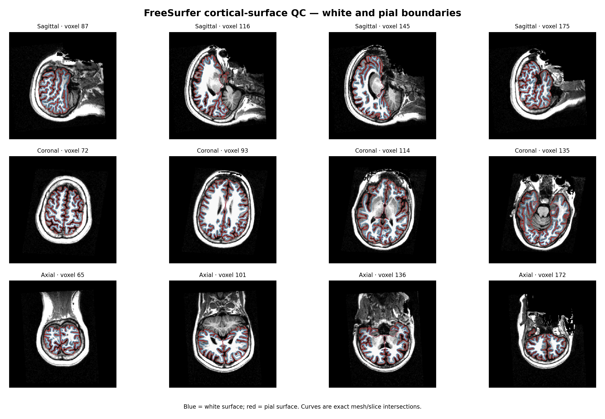
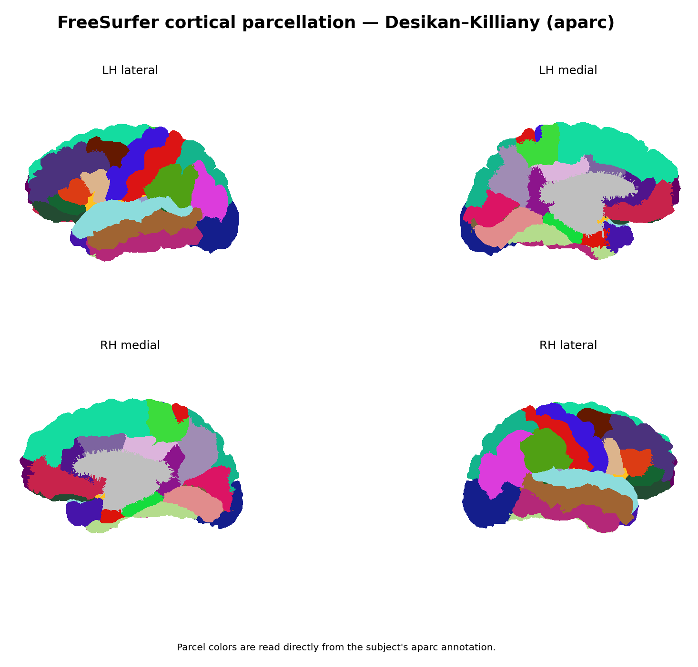
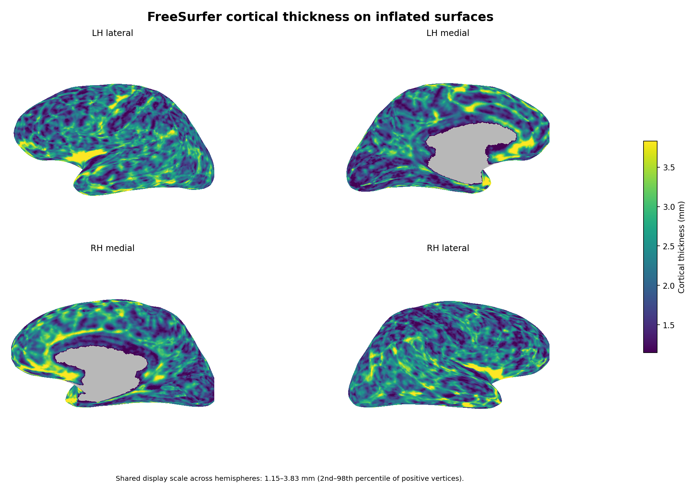
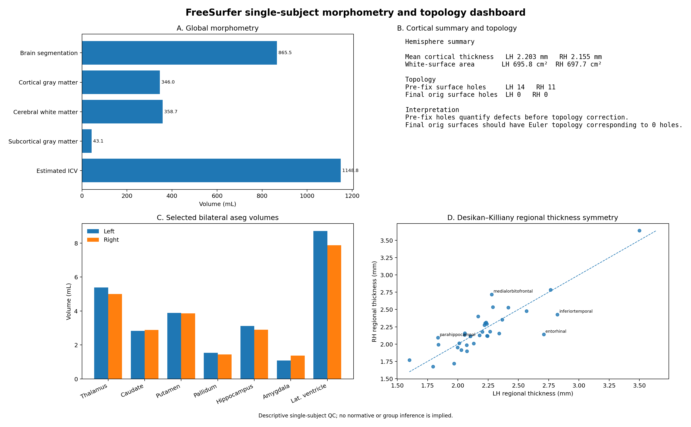

# Structural MRI cortical reconstruction with FreeSurfer

Reproducible single-subject structural MRI project demonstrating FreeSurfer cortical reconstruction, morphometry, topology validation, and visual quality control.

## Dataset

- OpenNeuro: `ds000114`
- Participant: `sub-01`
- Session: `ses-test`
- Structural image: T1-weighted MRI

## Software

- FreeSurfer 7.4.1
- Ubuntu 22.04.5 LTS
- OpenMP threads: 8

Initial processing:

```bash
recon-all \
  -s sub-01_ses-test \
  -i <T1w.nii.gz> \
  -all \
  -parallel \
  -openmp 8 \
  -noappend
```

The completed reconstruction is documented by `reports/recon-all_complete_sub-01_ses-test.log`.

## Reconstruction validation

The completed subject contains the expected final FreeSurfer products, including:

- `aseg.mgz`
- `aparc+aseg.mgz`
- left/right white surfaces
- left/right pial surfaces
- left/right cortical thickness
- Desikan-Killiany `aparc` annotations
- `aseg.stats`
- left/right `aparc.stats`

Topology was checked directly with `mris_euler_number`.

| Surface | Pre-fix holes | Final holes |
|---|---:|---:|
| Left hemisphere | 14 | 0 |
| Right hemisphere | 11 | 0 |

The pre-fix counts are FreeSurfer topology defects measured before correction. The final `lh.orig` and `rh.orig` surfaces both have Euler topology corresponding to zero holes.

The seven public morphometry tables were independently regenerated from the canonical FreeSurfer `*.stats` files using `asegstats2table` and `aparcstats2table`;
all seven reproduced the repository tables exactly.

## Quality-control figures

### Cortical surfaces on T1

Blue = white surface; red = pial surface. Curves are exact intersections between the FreeSurfer meshes and anatomical slices.



### Desikan-Killiany cortical parcellation

Parcel colors are read directly from the subject's `aparc` annotation.



### Cortical thickness

Vertex-wise cortical thickness displayed on inflated surfaces using one shared display scale across hemispheres.



### Morphometry and topology

Descriptive single-subject summary of global morphometry, bilateral subcortical volumes, hemispheric cortical measures, regional thickness symmetry, and topology correction.



Additional anatomical QC:

- [T1 with aseg segmentation](results/figures/freesurfer_aseg_multiplanar_qc_final.png)
- [Brain extraction / brainmask QC](results/figures/freesurfer_brainmask_qc_final.png)

## Quantitative outputs

`results/tables/` contains:

- subcortical and global volumes
- left/right Desikan-Killiany cortical thickness
- left/right cortical surface area
- left/right cortical volume

Selected global measures:

| Measure | Value |
|---|---:|
| Brain segmentation volume | 865.479 mL |
| Cortical gray matter volume | 345.972 mL |
| Cerebral white matter volume | 358.714 mL |
| Subcortical gray matter volume | 43.083 mL |
| Estimated intracranial volume | 1148.762 mL |
| Mean cortical thickness, LH | 2.2032 mm |
| Mean cortical thickness, RH | 2.15459 mm |
| White surface area, LH | 695.776 cm² |
| White surface area, RH | 697.659 cm² |

## Reproducible QC renderer

The final QC figures are generated with:

```bash
python3 scripts/02_qc_redesign/generate_freesurfer_qc.py \
  --subject-dir /path/to/FreeSurfer/sub-01_ses-test \
  --output-dir /path/to/qc_output \
  --freesurfer-home /path/to/freesurfer
```

The renderer reads the completed FreeSurfer subject and does not modify reconstruction outputs.

Dependencies used for the QC renderer include:

- Python 3
- NumPy
- Matplotlib
- NiBabel
- FreeSurfer command-line tools

## Interpretation

This repository demonstrates single-subject structural MRI processing and quality control.

The morphometric values are descriptive outputs for this subject. No normative, diagnostic, or group-level inference is made from this single-subject analysis.

## Repository structure

```text
reports/
  aseg_sub-01_ses-test.stats
  lh_aparc_sub-01_ses-test.stats
  rh_aparc_sub-01_ses-test.stats
  recon-all_complete_sub-01_ses-test.log
  freesurfer_qc_validation.md

results/
  figures/
  tables/

scripts/
  run_recon_all.sh
  02_qc_redesign/
    generate_freesurfer_qc.py
```

## Author

Rene Andrade Rey
ORCID: 0000-0001-5627-579X
